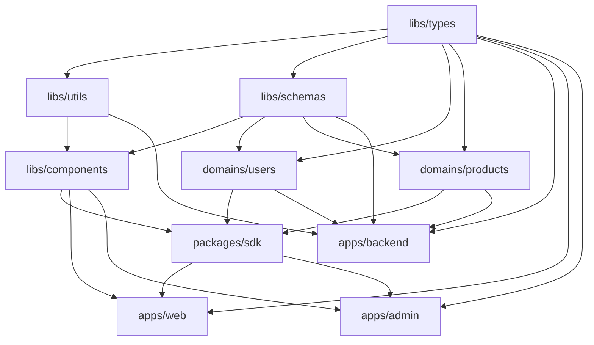

# Arvasit PNPM Monorepo Workspace

A comprehensive monorepo workspace using PNPM with apps, libs, domains, and packages, all scoped under `@arvasit`.

## Structure

```
├── apps/
│   ├── backend/          # NestJS backend application (@arvasit/backend)
│   ├── web/              # Next.js web frontend (@arvasit/web)
│   └── admin/            # Next.js admin dashboard (@arvasit/admin)
├── libs/
│   ├── types/            # Shared TypeScript types (@arvasit/types)
│   ├── utils/            # Common utility functions (@arvasit/utils)
│   ├── schemas/          # Global validation schemas (@arvasit/schemas)
│   └── components/       # Shared React component library (@arvasit/components)
├── domains/
│   ├── users/            # Users feature module (@arvasit/users)
│   └── products/         # Products feature module (@arvasit/products)
└── packages/
    └── sdk/              # API client SDK (@arvasit/sdk)
```

## Getting Started

### Prerequisites

- Node.js >= 18.0.0
- PNPM >= 8.0.0

### Installation

```bash
# Install all dependencies
pnpm install

# Build all packages
pnpm build

# Run all apps in development
pnpm dev

# Run specific app
pnpm --filter @arvasit/backend dev
pnpm --filter @arvasit/web dev
pnpm --filter @arvasit/admin dev
```

## Available Scripts

The workspace provides a comprehensive set of scripts organized by functionality and scope. All scripts use Turbo for efficient execution and dependency management.

### Core Development Scripts

#### Build & Development

- `pnpm build` - Build all packages using Turbo's dependency-aware pipeline
- `pnpm dev` - Start all applications in development mode (parallel execution)
- `pnpm typecheck` - Run TypeScript type checking across all packages
- `pnpm test` - Run all tests with proper dependency ordering

#### Code Quality

- `pnpm lint` - Lint all packages using ESLint with workspace-aware rules
- `pnpm lint:fix` - Auto-fix linting issues across the workspace
- `pnpm format` - Format all code using Prettier with workspace configuration

#### Cleanup & Maintenance

- `pnpm clean:all` - Clean all build outputs and temporary files
- `pnpm compile:all` - Compile TypeScript for all packages

### Advanced Workspace Management Scripts

#### Dependency-Aware Execution (`run-script.ts`)

The workspace includes a sophisticated script runner that handles dependency ordering and parallel execution:

**Basic Usage:**

```bash
pnpm run:script <package-folder> <command-name> [--parallel]
```

**Package Folders:**

- `all` - All packages (libs, domains, packages, apps)
- `libs` - Library packages only
- `domains` - Domain packages only
- `packages` - Package packages only
- `apps` - Application packages only

**Key Features:**

- **Dependency Resolution**: Automatically detects internal dependencies (`@arvasit/*`) and executes in correct order
- **Circular Dependency Detection**: Identifies and reports circular dependency chains
- **Parallel Execution**: Use `--parallel` flag for concurrent execution while respecting dependencies
- **Error Handling**: Comprehensive error reporting with clear failure messages

**Examples:**

```bash
# Build all packages in dependency order
pnpm run:script all build

# Start all apps in parallel (dependency-ordered startup)
pnpm run:script apps dev --parallel

# Run linting for all libraries
pnpm run:script libs lint

# Run tests for domains in parallel
pnpm run:script domains test --parallel
```

#### Comprehensive Script Categories

**All Packages (`all`):**

- `pnpm build:all` - Build all packages in dependency order
- `pnpm lint:all` - Lint all packages
- `pnpm format:write:all` - Format all packages
- `pnpm format:check:all` - Check formatting across all packages
- `pnpm test:all` - Run all tests
- `pnpm circular-deps:check:all` - Check for circular dependencies

**Libraries (`libs`):**

- `pnpm libs:compile` - Compile all library packages
- `pnpm libs:build` - Build all libraries
- `pnpm libs:start` - Start library development servers
- `pnpm libs:lint` - Lint all libraries
- `pnpm libs:format:check` - Check library formatting
- `pnpm libs:format:write` - Format all libraries
- `pnpm libs:test` - Test all libraries
- `pnpm libs:clean` - Clean all library builds

**Domains (`domains`):**

- `pnpm domains:compile` - Compile all domain packages
- `pnpm domains:build` - Build all domains
- `pnpm domains:start` - Start domain development servers
- `pnpm domains:lint` - Lint all domains
- `pnpm domains:format:check` - Check domain formatting
- `pnpm domains:format:write` - Format all domains
- `pnpm domains:test` - Test all domains
- `pnpm domains:clean` - Clean all domain builds

**Packages (`packages`):**

- `pnpm packages:compile` - Compile all package packages
- `pnpm packages:build` - Build all packages
- `pnpm packages:start` - Start package development servers
- `pnpm packages:lint` - Lint all packages
- `pnpm packages:format:check` - Check package formatting
- `pnpm packages:format:write` - Format all packages
- `pnpm packages:test` - Test all packages
- `pnpm packages:clean` - Clean all package builds

**Applications (`apps`):**

- `pnpm apps:compile` - Compile all applications
- `pnpm apps:build` - Build all applications
- `pnpm apps:start` - Start all applications
- `pnpm apps:start:dev` - Start all applications in development mode
- `pnpm apps:lint` - Lint all applications
- `pnpm apps:format:check` - Check application formatting
- `pnpm apps:format:write` - Format all applications
- `pnpm apps:test` - Test all applications
- `pnpm apps:circular-deps:check` - Check for circular dependencies

### Individual Application Scripts

**Backend (`@arvasit/backend`):**

- `pnpm backend:compile` - Compile backend TypeScript
- `pnpm backend:build` - Build backend application
- `pnpm backend:lint` - Lint backend code
- `pnpm backend:test` - Run backend tests
- `pnpm backend:circular-deps:check` - Check backend circular dependencies
- `pnpm backend:start:dev` - Start backend in development mode

**Web Frontend (`@arvasit/web`):**

- `pnpm web:compile` - Compile web frontend TypeScript
- `pnpm web:build` - Build web frontend
- `pnpm web:lint` - Lint web frontend code
- `pnpm web:circular-deps:check` - Check web circular dependencies
- `pnpm web:start:dev` - Start web frontend in development mode

**Admin Dashboard (`@arvasit/admin`):**

- `pnpm admin:compile` - Compile admin dashboard TypeScript
- `pnpm admin:build` - Build admin dashboard
- `pnpm admin:lint` - Lint admin dashboard code
- `pnpm admin:test` - Run admin dashboard tests
- `pnpm admin:circular-deps:check` - Check admin circular dependencies
- `pnpm admin:start:dev` - Start admin dashboard in development mode

### Component Library Scripts

- `pnpm storybook` - Start Storybook development server for component library
- `pnpm build-storybook` - Build static Storybook files for deployment

### Export Generation Scripts

#### Library Export Generator (`generate-library-exports.ts`)

Automatically generates `exports` field in `package.json` for clean module imports:

**Usage:**

```bash
pnpm generate-exports <library-name>
```

**Features:**

- Scans `src` directory for TypeScript files and subdirectories
- Creates barrel exports for directories with `index.ts` files
- Generates individual exports for standalone `.ts` files
- Skips test files (`.spec.ts`, `.test.ts`) and test directories (`__*`)
- Updates `package.json` with proper export mappings

**Examples:**

```bash
# Generate exports for utils library
pnpm generate-exports utils

# Generate exports for users domain
pnpm generate-exports users

# Generate exports for components library
pnpm generate-exports components
```

**Generated Export Format:**

```json
{
  "./": {
    "types": "./dist/index.d.ts",
    "require": "./dist/index.js",
    "import": "./dist/index.js"
  },
  "./path/to/file": {
    "types": "./dist/path/to/file.d.ts",
    "require": "./dist/path/to/file.js",
    "import": "./dist/path/to/file.js"
  }
}
```

### CI/CD Scripts

- `pnpm run:ci` - Trigger full CI pipeline (commits empty commit and pushes)
- `pnpm prepare` - Husky pre-commit hook setup

## Package Details

### Apps

- **@arvasit/backend** - NestJS backend API server (port 3001)
- **@arvasit/web** - Next.js web frontend (port 3000)
- **@arvasit/admin** - Next.js admin dashboard (port 3002)

### Libraries

- **@arvasit/types** - Shared TypeScript types and interfaces
- **@arvasit/utils** - Common utility functions
- **@arvasit/schemas** - Zod validation schemas
- **@arvasit/components** - React component library with Storybook

### Domains

- **@arvasit/users** - User management DTOs, schemas, and types
- **@arvasit/products** - Product management DTOs, schemas, and types

### Packages

- **@arvasit/sdk** - API client SDK for consuming backend services

## Project Flow & Development Workflow

### Architecture Overview

The Arvasit monorepo follows a layered architecture with clear separation of concerns:

```
┌─────────────────────────────────────────────────────────────┐
│                    Applications Layer                       │
├─────────────────┬─────────────────┬─────────────────────────┤
│   Web Frontend  │  Admin Dashboard│      Backend API        │
│   (@arvasit/web)│ (@arvasit/admin)│   (@arvasit/backend)    │
└─────────────────┴─────────────────┴─────────────────────────┘
                              │
┌─────────────────────────────────────────────────────────────┐
│                    Packages Layer                           │
├─────────────────────────────────────────────────────────────┤
│                    SDK (@arvasit/sdk)                       │
└─────────────────────────────────────────────────────────────┘
                              │
┌─────────────────────────────────────────────────────────────┐
│                    Domains Layer                            │
├─────────────────┬─────────────────┬─────────────────────────┤
│   Users Domain  │ Products Domain │     Future Domains      │
│ (@arvasit/users)│(@arvasit/products)│                        │
└─────────────────┴─────────────────┴─────────────────────────┘
                              │
┌─────────────────────────────────────────────────────────────┐
│                    Libraries Layer                          │
├─────────┬─────────┬─────────┬───────────────────────────────┤
│  Types  │  Utils  │ Schemas │        Components             │
│(@arvasit│(@arvasit│(@arvasit│     (@arvasit/components)     │
│/types)  │/utils)  │/schemas)│                               │
└─────────┴─────────┴─────────┴───────────────────────────────┘
```

### Development Workflow

#### 1. Initial Setup

```bash
# Clone and install dependencies
git clone <repository-url>
cd arvasit-workspace
pnpm install

# Build all packages in dependency order
pnpm build:all

# Start all applications in development mode
pnpm dev
```

#### 2. Daily Development Workflow

**Starting Development:**

```bash
# Option 1: Start all apps (recommended for full-stack development)
pnpm dev

# Option 2: Start specific apps
pnpm backend:start:dev    # Backend API (port 3001)
pnpm web:start:dev        # Web frontend (port 3000)
pnpm admin:start:dev      # Admin dashboard (port 3002)

# Option 3: Start with dependency-aware script
pnpm run:script apps dev --parallel
```

**Making Changes:**

1. **Library Changes**: Modify shared libraries (`libs/`, `domains/`)
2. **Component Changes**: Update shared components (`libs/components`)
3. **Application Changes**: Modify specific applications (`apps/`)

**Testing Changes:**

```bash
# Run all tests
pnpm test:all

# Run tests for specific scope
pnpm libs:test
pnpm domains:test
pnpm apps:test

# Run tests in parallel
pnpm run:script all test --parallel
```

**Code Quality Checks:**

```bash
# Lint all packages
pnpm lint:all

# Auto-fix linting issues
pnpm lint:fix

# Format all code
pnpm format:write:all

# Check formatting
pnpm format:check:all

# Type check all packages
pnpm typecheck
```

#### 3. Build Process Flow

The build process follows a strict dependency order:



**Build Commands:**

```bash
# Build everything in correct order
pnpm build:all

# Build specific layers
pnpm libs:build        # Libraries first
pnpm domains:build     # Domains second
pnpm packages:build    # Packages third
pnpm apps:build        # Applications last

# Build individual packages
pnpm backend:build
pnpm web:build
pnpm admin:build
```

#### 4. Package Management Workflow

**Adding New Libraries:**

```bash
# 1. Create new library structure
mkdir libs/new-library
cd libs/new-library

# 2. Initialize package.json
pnpm init

# 3. Add to workspace
# Update pnpm-workspace.yaml if needed

# 4. Generate exports
pnpm generate-exports new-library

# 5. Build and test
pnpm libs:build
pnpm libs:test
```

**Adding New Domains:**

```bash
# 1. Create domain structure
mkdir domains/new-domain
cd domains/new-domain

# 2. Follow same process as libraries
# 3. Generate exports
pnpm generate-exports new-domain
```

**Adding New Applications:**

```bash
# 1. Create app structure
mkdir apps/new-app
cd apps/new-app

# 2. Initialize with appropriate framework
# 3. Add to workspace
# 4. Update turbo.json if needed
```

#### 5. Dependency Management

**Internal Dependencies:**

- All internal packages use `@arvasit/*` scope
- Dependencies are automatically resolved by the workspace scripts
- Circular dependencies are detected and prevented

**External Dependencies:**

- Add to root `package.json` for workspace-wide tools
- Add to individual package `package.json` for specific needs
- Use `pnpm add <package> --filter <package-name>` for specific packages

#### 6. CI/CD Integration

**Pre-commit Hooks:**

```bash
# Automatically runs on git commit
pnpm lint:fix
pnpm format:write:all
pnpm typecheck
```

**Full CI Pipeline:**

```bash
# Trigger complete CI pipeline
pnpm run:ci
```

**CI Pipeline Steps:**

1. Install dependencies (`pnpm install`)
2. Lint all packages (`pnpm lint:all`)
3. Type check (`pnpm typecheck`)
4. Build all packages (`pnpm build:all`)
5. Run all tests (`pnpm test:all`)
6. Check circular dependencies (`pnpm circular-deps:check:all`)

### Development Best Practices

#### 1. Package Organization

- **Libraries**: Shared utilities, types, and components
- **Domains**: Business logic and data models
- **Packages**: External-facing packages (SDK)
- **Apps**: End-user applications

#### 2. Import Patterns

```typescript
// ✅ Good: Use scoped imports
import { CreateUserDto } from '@arvasit/users';
import { Button } from '@arvasit/components';
import { formatCurrency } from '@arvasit/utils';

// ❌ Bad: Relative imports across packages
import { CreateUserDto } from '../../../domains/users/src/dto';
```

#### 3. Script Usage Guidelines

- Use `pnpm run:script` for complex workflows requiring dependency ordering
- Use `--parallel` flag for long-running commands (dev, test)
- Use individual package scripts for focused development
- Always run `pnpm lint:fix` before committing

#### 4. Testing Strategy

- Unit tests in each package's `__tests__` directory
- Integration tests in applications
- Use `pnpm test:all` for comprehensive testing
- Run tests in parallel for faster feedback

#### 5. Build Optimization

- Libraries build first (types, utils, schemas)
- Components build after dependencies
- Domains build after schemas
- SDK builds after all dependencies
- Applications build last

## Troubleshooting Guide

### Common Issues and Solutions

#### Build Failures

**Issue**: Build fails with dependency errors

```bash
# Solution 1: Clean and rebuild
pnpm clean:all
pnpm build:all

# Solution 2: Check for circular dependencies
pnpm circular-deps:check:all

# Solution 3: Verify TypeScript compilation
pnpm typecheck

# Solution 4: Build in stages
pnpm libs:build
pnpm domains:build
pnpm packages:build
pnpm apps:build
```

**Issue**: TypeScript compilation errors

```bash
# Check all packages for type errors
pnpm typecheck

# Check specific package
pnpm --filter @arvasit/utils typecheck

# Clean TypeScript build info
find . -name "*.tsbuildinfo" -delete
pnpm build:all
```

#### Dependency Issues

**Issue**: Package not found errors

```bash
# Reinstall all dependencies
rm -rf node_modules
rm pnpm-lock.yaml
pnpm install

# Check workspace configuration
cat pnpm-workspace.yaml

# Verify package names in package.json files
grep -r "name.*@arvasit" */package.json
```

**Issue**: Circular dependency warnings

```bash
# Check for circular dependencies
pnpm circular-deps:check:all

# Check specific scope
pnpm apps:circular-deps:check
pnpm libs:circular-deps:check

# Use dependency cruiser for detailed analysis
npx depcruise --validate dependency-cruiser.config.js
```

#### Development Server Issues

**Issue**: Port conflicts or servers not starting

```bash
# Kill all Node processes
pkill -f "next\|nest\|node"

# Check port usage
lsof -i :3000
lsof -i :3001
lsof -i :3002

# Start with dependency ordering
pnpm run:script apps dev --parallel

# Start individual apps
pnpm backend:start:dev
pnpm web:start:dev
pnpm admin:start:dev
```

**Issue**: Hot reload not working

```bash
# Restart development servers
pnpm dev

# Clear Next.js cache
rm -rf apps/web/.next
rm -rf apps/admin/.next

# Clear Turbo cache
pnpm turbo prune
```

#### Script Execution Issues

**Issue**: `run-script.ts` fails with dependency errors

```bash
# Check script syntax
pnpm run:script --help

# Run with verbose output
pnpm run:script all build --verbose

# Check package.json scripts
grep -r "scripts" */package.json
```

**Issue**: Export generation fails

```bash
# Check library structure
ls -la libs/utils/src/
ls -la domains/users/src/

# Verify package.json exists
ls -la libs/utils/package.json

# Run with specific library
pnpm generate-exports utils
```

#### Code Quality Issues

**Issue**: Linting errors

```bash
# Auto-fix linting issues
pnpm lint:fix

# Check specific package
pnpm --filter @arvasit/utils lint

# Update ESLint configuration
cat eslint.config.mjs
```

**Issue**: Formatting inconsistencies

```bash
# Format all files
pnpm format:write:all

# Check formatting
pnpm format:check:all

# Format specific package
pnpm --filter @arvasit/utils format:write
```

#### Performance Issues

**Issue**: Slow build times

```bash
# Use Turbo cache
pnpm turbo prune

# Build only changed packages
pnpm build --filter=...[HEAD~1]

# Check build output
pnpm build --dry-run
```

**Issue**: Memory issues during development

```bash
# Increase Node.js memory limit
export NODE_OPTIONS="--max-old-space-size=4096"

# Use parallel execution carefully
pnpm run:script apps dev --parallel

# Monitor memory usage
top -p $(pgrep -f "node")
```

### Debugging Commands

#### Package Discovery

```bash
# List all packages
pnpm list --depth=0

# Check workspace packages
pnpm -r list --depth=0

# Verify package structure
find . -name "package.json" -not -path "./node_modules/*"
```

#### Dependency Analysis

```bash
# Check internal dependencies
grep -r "@arvasit/" */package.json

# Analyze dependency tree
pnpm list --depth=1

# Check for unused dependencies
npx depcheck
```

#### Build Analysis

```bash
# Check build outputs
find . -name "dist" -type d
find . -name ".next" -type d

# Verify TypeScript compilation
npx tsc --noEmit --project tsconfig.json

# Check for build artifacts
ls -la */dist/
```

### Getting Help

#### Log Analysis

```bash
# Enable verbose logging
pnpm run:script all build --verbose

# Check Turbo logs
pnpm turbo run build --verbose

# Enable debug mode
DEBUG=* pnpm dev
```

#### Environment Issues

```bash
# Check Node.js version
node --version
pnpm --version

# Verify environment variables
env | grep NODE
env | grep PNPM

# Check system resources
df -h
free -h
```

#### Workspace Configuration

```bash
# Verify workspace setup
cat pnpm-workspace.yaml
cat turbo.json
cat tsconfig.json

# Check package manager
cat package.json | grep packageManager
```

### Emergency Recovery

#### Complete Reset

```bash
# Nuclear option: complete reset
rm -rf node_modules
rm -rf */node_modules
rm -rf */dist
rm -rf */.next
rm pnpm-lock.yaml
pnpm install
pnpm build:all
```

#### Selective Reset

```bash
# Reset specific package
rm -rf apps/web/node_modules
rm -rf apps/web/.next
pnpm --filter @arvasit/web install
pnpm --filter @arvasit/web build
```

#### Cache Clearing

```bash
# Clear all caches
pnpm store prune
pnpm turbo prune
rm -rf ~/.pnpm-store

# Clear specific caches
rm -rf apps/web/.next/cache
rm -rf apps/admin/.next/cache
```

## Development

### TypeScript Path Resolution

All packages use TypeScript path mapping for clean imports with `@arvasit/*` scope:

```typescript
import { Button } from '@arvasit/components';
import { UserSchema } from '@arvasit/schemas';
import { ApiClient } from '@arvasit/sdk';
import { CreateUserDto } from '@arvasit/users';
import { formatCurrency } from '@arvasit/utils';
```

### Component Library

The component library includes:

- Tailwind CSS for styling
- TypeScript support
- Storybook for documentation
- Both CJS and ESM builds via tsup

To run Storybook:

```bash
pnpm storybook
```

### Building

The build process follows topological ordering:

1. Libraries (types, utils, schemas)
2. Components (depends on types, utils)
3. Domains (depends on types, schemas)
4. SDK (depends on all above)
5. Apps (depend on all packages)

## Practical Examples & Use Cases

### Common Development Scenarios

#### Scenario 1: Full-Stack Development Setup

```bash
# Start complete development environment
pnpm dev

# This starts:
# - Backend API on port 3001
# - Web frontend on port 3000
# - Admin dashboard on port 3002
# - All with hot reload enabled
```

#### Scenario 2: Working on Shared Libraries

```bash
# Make changes to utils library
cd libs/utils
# Edit files...

# Build and test the library
pnpm libs:build
pnpm libs:test

# Check if changes break dependent packages
pnpm run:script all build
```

#### Scenario 3: Adding New Domain Logic

```bash
# Create new domain
mkdir domains/orders
cd domains/orders

# Initialize package
pnpm init
# Edit package.json to add @arvasit/orders name

# Generate exports automatically
pnpm generate-exports orders

# Build and test
pnpm domains:build
pnpm domains:test
```

#### Scenario 4: Component Development with Storybook

```bash
# Start Storybook for component development
pnpm storybook

# Make changes to components
cd libs/components
# Edit Button.tsx...

# Build components library
pnpm libs:build

# Build static Storybook for deployment
pnpm build-storybook
```

#### Scenario 5: Pre-commit Quality Checks

```bash
# Run all quality checks before committing
pnpm lint:all
pnpm format:check:all
pnpm typecheck
pnpm test:all

# Auto-fix issues
pnpm lint:fix
pnpm format:write:all
```

#### Scenario 6: CI/CD Pipeline Simulation

```bash
# Simulate full CI pipeline locally
pnpm install
pnpm lint:all
pnpm typecheck
pnpm build:all
pnpm test:all
pnpm circular-deps:check:all
```

### Advanced Script Usage Examples

#### Parallel Development Servers

```bash
# Start all apps in parallel with dependency ordering
pnpm run:script apps dev --parallel

# This ensures:
# 1. Backend starts first (no dependencies)
# 2. Web and Admin start in parallel (both depend on backend)
# 3. All maintain hot reload
```

#### Selective Testing

```bash
# Test only libraries
pnpm libs:test

# Test only domains
pnpm domains:test

# Test everything in parallel
pnpm run:script all test --parallel
```

#### Build Optimization

```bash
# Build only what's needed
pnpm libs:build        # Libraries first
pnpm domains:build     # Then domains
pnpm packages:build    # Then packages
pnpm apps:build        # Finally apps

# Or build everything in correct order
pnpm build:all
```

#### Dependency Analysis

```bash
# Check for circular dependencies
pnpm circular-deps:check:all

# Check specific scope
pnpm apps:circular-deps:check
```

### Real-World Usage Examples

#### Using the SDK

```typescript
import { CreateProductDto } from '@arvasit/products';
import { createApiClient } from '@arvasit/sdk';
import { CreateUserDto } from '@arvasit/users';

const apiClient = createApiClient({
  baseUrl: 'http://localhost:3001',
  apiKey: 'your-api-key',
});

// Create a user
const userData: CreateUserDto = {
  email: 'user@example.com',
  name: 'John Doe',
  password: 'securepassword',
};

const userResponse = await apiClient.createUser(userData);

// Create a product
const productData: CreateProductDto = {
  name: 'Example Product',
  price: 99.99,
  category: 'electronics',
  sku: 'PROD-001',
};

const productResponse = await apiClient.createProduct(productData);
```

#### Using Components

```typescript
import { Button } from '@arvasit/components';
import { formatCurrency } from '@arvasit/utils';

function MyComponent() {
  return (
    <div>
      <Button variant="primary" size="lg">
        Click me
      </Button>
      <p>Price: {formatCurrency(99.99)}</p>
    </div>
  );
}
```

#### Domain-Specific Imports

```typescript
// Clean imports using generated exports
import { CreateUserDto, UpdateUserDto } from '@arvasit/users/dto';
import { UserSchema, UserValidationSchema } from '@arvasit/users/schema';
import { User, UserRole } from '@arvasit/users/types';
import { chunk, groupBy } from '@arvasit/utils/array';
// Utility functions
import { formatDate, parseDate } from '@arvasit/utils/date';
import { sanitizeString, validateEmail } from '@arvasit/utils/validation';
```

### Script Automation Examples

#### Development Workflow Script

```bash
#!/bin/bash
# dev-workflow.sh

echo "🚀 Starting Arvasit Development Workflow"

# Clean and install
echo "📦 Installing dependencies..."
pnpm install

# Build all packages
echo "🔨 Building all packages..."
pnpm build:all

# Start development servers
echo "🌐 Starting development servers..."
pnpm dev
```

#### Pre-commit Hook Script

```bash
#!/bin/bash
# pre-commit.sh

echo "🔍 Running pre-commit checks..."

# Lint and fix
pnpm lint:fix

# Format code
pnpm format:write:all

# Type check
pnpm typecheck

# Run tests
pnpm test:all

echo "✅ Pre-commit checks passed!"
```

#### CI Pipeline Script

```bash
#!/bin/bash
# ci-pipeline.sh

set -e

echo "🔄 Running CI Pipeline..."

# Install dependencies
pnpm install

# Lint all packages
pnpm lint:all

# Type check
pnpm typecheck

# Build all packages
pnpm build:all

# Run all tests
pnpm test:all

# Check circular dependencies
pnpm circular-deps:check:all

echo "✅ CI Pipeline completed successfully!"
```

### Export Generation

The workspace includes an automated script to generate `exports` fields for all libraries, domains, and packages:

```bash
# Generate exports for a specific library
pnpm generate-exports utils
pnpm generate-exports users
pnpm generate-exports components

# Or use ts-node directly
pnpm ts-node scripts/generate-library-exports.ts <library-name>
```

The script automatically:

- Scans the `src` directory for `.ts` files and subdirectories
- Creates barrel exports for directories with `index.ts` files
- Creates individual exports for standalone `.ts` files
- Skips test files and test directories
- Updates the `package.json` with proper export mappings

This enables clean imports like:

```typescript
import { Button } from '@arvasit/components';
import { CreateUserDto } from '@arvasit/users/dto';
import { formatCurrency } from '@arvasit/utils/string';
```

### Advanced Workspace Management

The workspace includes a sophisticated `run-script.ts` for dependency-aware command execution:

```bash
# Build all packages in dependency order
pnpm run all build

# Start all apps in parallel
pnpm run apps dev --parallel

# Run specific commands for specific package types
pnpm run libs build
pnpm run domains test
pnpm run packages lint
```

**Key Features:**

- **Dependency Ordering**: Automatically runs commands in the correct order based on internal dependencies
- **Parallel Execution**: Run commands in parallel while respecting dependency order
- **Package Discovery**: Automatically finds packages in `libs/`, `domains/`, `packages/`, and `apps/`
- **Error Handling**: Comprehensive error handling with clear messages
- **Circular Dependency Detection**: Detects and reports circular dependencies

**Use Cases:**

- Complex build processes that need dependency ordering
- Running development servers in parallel
- Batch operations across multiple package types
- CI/CD workflows that need reliable execution order

## Contributing

1. Create a feature branch
2. Make your changes
3. Run `pnpm lint` and `pnpm format`
4. Run `pnpm type-check`
5. Submit a pull request

## License

MIT
